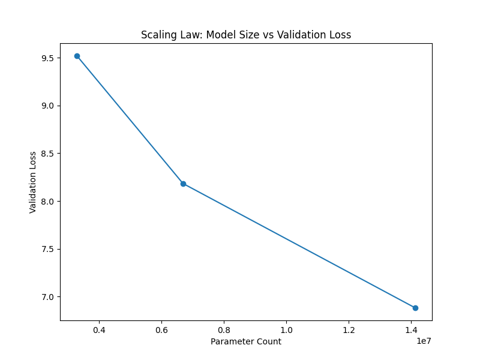
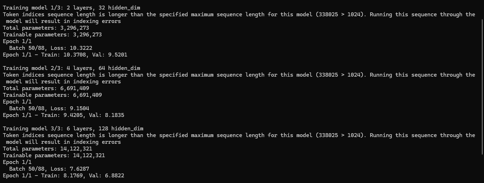
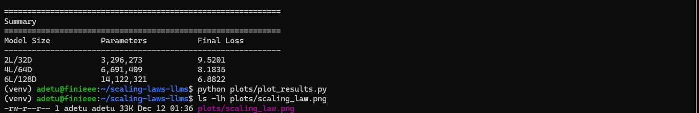

# scaling-laws-llms

This repository explores empirical scaling laws in small transformer language models to observe how model size affects learning dynamics.

## Background

Scaling laws describe predictable relationships between model capacity and performance. Understanding these relationships helps estimate the compute and model size required to achieve target performance levels. This project examines scaling behavior in the small model regime to observe power-law relationships between parameters and validation loss.

## Experiment Setup

The experiment trains transformer language models of increasing size on the tiny_shakespeare dataset. Three model configurations are used: 2 layers with 32 hidden dimensions, 4 layers with 64 hidden dimensions, and 6 layers with 128 hidden dimensions. The dataset is tokenized with GPT-2 tokenizer, limited to 100,000 tokens, and split into 90% training and 10% validation sets. Each model trains for 1 epoch using AdamW optimizer with a learning rate of 3e-4, batch size of 8, and sequence length of 128 tokens.

## Usage

Run the scaling experiment:

```bash
python experiments/run_scaling.py
```

Generate a visualization of the scaling relationship:

```bash
python plots/plot_results.py
```

## Results

### Training Curve

This plot shows how validation loss changes with model size.



### Training Logs

This image shows the terminal logs for all three model runs.



### Model Summary

This screenshot summarizes model sizes, parameter counts, and final validation losses.



## Interpretation

As model size increases, validation loss typically decreases following a power-law relationship. Larger models generally achieve lower loss due to increased capacity, though the rate of improvement may diminish at larger scales. The relationship between log parameters and log loss is often approximately linear in the power-law regime.
